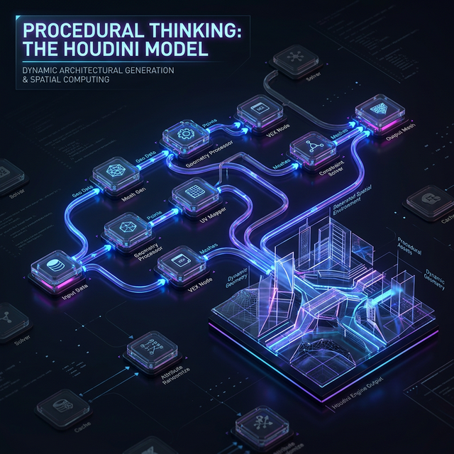

# ╔══════════════════════════════════════════════════════════════╗

# ║ 🧠 PHASE 0: PHILOSOPHY & METHOD ║

# ║ Read this first. Everything else grows from these ideas. ║

# ╚══════════════════════════════════════════════════════════════╝

# ┌─────────────────────────────────────┐

# │ 📖 TABLE OF CONTENTS │

# └─────────────────────────────────────┘

- [0.1 The Core Thesis](#01-the-core-thesis)
- [0.2 Procedural Thinking (The Houdini Model)](#02-procedural-thinking-the-houdini-model)
- [0.3 The Evolutionary Method](#03-the-evolutionary-method)
- [0.4 The Hot-Swap Principle](#04-the-hot-swap-principle)
- [0.5 The Autonomy Contract](#05-the-autonomy-contract)
- [0.6 The Simulation Philosophy — Malleable Physics](#06-the-simulation-philosophy--malleable-physics)
- [0.7 The 3D Quality Imperative](#07-the-3d-quality-imperative)

---

## 0.1 The Core Thesis

This system grows from a single seed input into a complete spatial computing environment with autonomous AI agents, real-world API connections, multiplayer collaboration, and visual orchestration.

It is built **procedurally** — each step generates the conditions for the next step, like a tree growing from a seed. Not hand-assembled. Not hard-coded. Grown.

The end result is a canvas that **replaces traditional computing interfaces**. File systems become spatial zones. Terminal becomes agent workspaces. Browser tabs become content surfaces. Project management becomes a visual timeline. Everything is visible, spatial, navigable through time, and comprehensible to humans.

---

## 0.2 Procedural Thinking (The Houdini Model)



In Houdini, Grasshopper, or Blender's Geometry Nodes, you don't build a result. You build a **recipe** — a graph of operations where each node takes input, transforms it, and produces output. Change the input and the entire result updates.

This is our model for building software:

- Every feature is a **NODE** in a procedural graph, not hand-coded logic
- Every node connects to others through **TYPED INTERFACES** (ports)
- The graph itself IS the architecture — not a diagram of the architecture
- Any node can be **swapped** for a different implementation if it respects the interface
- The system is **always live** — change propagates through the graph in real time

**Why this matters for the builder agent:** You are not writing an application. You are building a graph of modules that generates an application. When you build a module, you build a recipe node. When you connect modules, you connect recipe nodes. The application emerges from the graph.

---

## 0.3 The Evolutionary Method

We do not pick one technology and commit. We spawn multiple approaches simultaneously, test each against concrete criteria, and keep the winners. This is genetic selection applied to architecture:

```
1. SPAWN  → Build 2-3 implementations of a module behind the same interface
2. TEST   → Run each implementation against the validation protocol
3. MEASURE → Score each on performance, reliability, simplicity, flexibility
4. SELECT → Keep the best performer. Archive the others as documented alternatives
5. BRANCH → Use the winner as the new base. Spawn variants of IT for the next round
6. DOCUMENT → Record why the winner won and why others lost
```

**The key insight:** You don't have to guess which technology is best. Build all the candidates, test them, and let the data decide. The "losers" are not wasted work — they are documented alternatives ready for hot-swap if conditions change.

---

## 0.4 The Hot-Swap Principle

Nothing in the system is permanent except the **interfaces between modules**. Every module sits behind an interface contract. Swapping a module means:

1. The new module implements the same interface
2. The existing validation tests pass with the new module
3. **No other module in the system needs to change**

If swapping a module requires changing other modules, the interface was designed wrong. Fix the interface, not the modules.

This applies to everything: canvas renderers, LLM providers, sync engines, API connectors, auth systems, storage backends, hosting targets. Everything is a replaceable cartridge behind a stable socket.

---

## 0.5 The Autonomy Contract

This document is written so that Claude Code (or any capable AI coding agent) can execute the entire build procedure without human input. This means:

- **Every decision point has a default** with clear criteria for when to deviate
- **Every phase has a self-validation test** — the agent checks its own work
- **Every external dependency has a fallback** if unavailable
- **The build order guarantees** no phase requires something not yet built
- **The agent never stops to ask permission** — it builds, tests, iterates, and reports when done

**The human interacts with the finished product, not the building process.**

---

## 0.6 The Simulation Philosophy — Malleable Physics

This is a critical mental model for the builder agent to internalize:

**In the virtual canvas, we are not bound by real-world physics.** The simulation defines its own laws. This is not a limitation — it is a superpower. We can engineer:

### Impossible Tools

- A "magnifying glass" that zooms into any data structure at any depth
- A "time telescope" that sees forward along predicted timelines
- "Gravity wells" that attract related information together automatically

### Bent Physics

- Data packets that "teleport" between distant agents instantly
- Pipes that "multiply" throughput — one input produces many outputs
- Workspaces that "fold" through z-space to be in two places at once

### Productive Illusion

- Visual effects that look like magic but produce real, usable output
- An agent that "casts a spell" (runs a complex pipeline) and the result materializes
- Assembly points that "fuse" components with particle effects — the visual drama IS the real process

### Why This Matters

When building the simulation layer, don't be constrained by "how things work in reality." Ask: **what visual metaphor would make this process most comprehensible and delightful?** Then implement the metaphor. If data assembly looks like construction, build it as construction. If agent coordination looks like a dance, choreograph it as a dance. The illusion creates real understanding.

**Key engineering principle:** Every "magical" visual effect must map to a real computational process. The magic is in the presentation, not the underlying mechanics. But the presentation IS part of the product — it is how humans comprehend what the system is doing.

---

## 0.7 The 3D Quality Imperative

Current AI coding agents (including you, Claude Code) produce functional but visually mediocre 3D output. This is unacceptable for a system designed to be beautiful and comprehensible. The gap between "default Three.js output" and "production-quality 3D" is enormous.

**The solution is a quality pipeline** — a structured process that ensures every 3D element meets a high visual bar. This pipeline is detailed in [07-3D-QUALITY-PIPELINE.md](./07-3D-QUALITY-PIPELINE.md), but the philosophy is:

1. **Never accept default materials.** Default gray Lambert is death. Everything gets physically-based materials with appropriate roughness, metalness, environment mapping, and lighting response.

2. **Procedural > hand-authored.** Use Geometry Nodes patterns (even in code) to generate geometry procedurally. Parametric shapes, subdivision surfaces, smooth curves. Not raw box geometry.

3. **AI-assisted asset generation.** Tools like Meshy and Tripo can generate 3D models from text or images. These become the "raw materials" that the quality pipeline refines — retopologizing, rigging, optimizing, and integrating into the scene.

4. **Animation is not optional.** Static 3D feels dead. Everything breathes — subtle idle animations, transitions, physics-based secondary motion. The heartbeat system already provides the tick; the 3D layer must respond to it visually.

5. **Optimization is quality.** A beautiful scene that runs at 15fps is not beautiful. Target 60fps on mid-range devices. LOD (level of detail), instancing, texture atlasing, and geometry budgets are quality measures, not compromises.

---

# ┌─────────────────────────────────────┐

# │ 📖 TABLE OF CONTENTS (BOTTOM) │

# └─────────────────────────────────────┘

- [0.1 The Core Thesis](#01-the-core-thesis)
- [0.2 Procedural Thinking (The Houdini Model)](#02-procedural-thinking-the-houdini-model)
- [0.3 The Evolutionary Method](#03-the-evolutionary-method)
- [0.4 The Hot-Swap Principle](#04-the-hot-swap-principle)
- [0.5 The Autonomy Contract](#05-the-autonomy-contract)
- [0.6 The Simulation Philosophy — Malleable Physics](#06-the-simulation-philosophy--malleable-physics)
- [0.7 The 3D Quality Imperative](#07-the-3d-quality-imperative)
