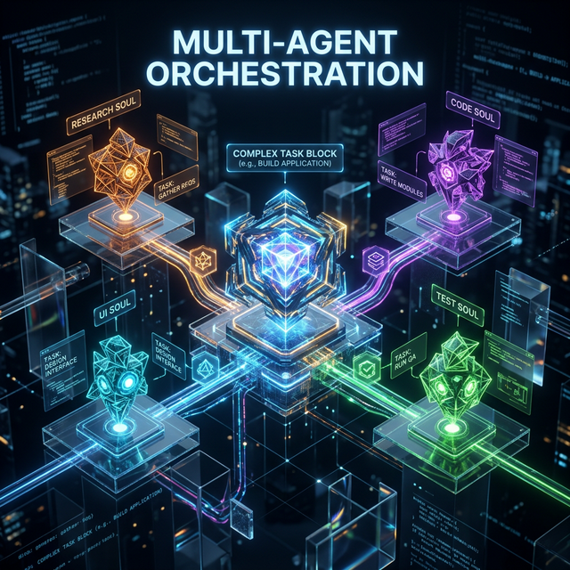

# ╔══════════════════════════════════════════════════════════════╗

# ║ 🤖 PHASE 3: THE AGENT LAYER ║

# ║ Souls, heartbeats, skills, multi-agent orchestration ║

# ╚══════════════════════════════════════════════════════════════╝

# ┌─────────────────────────────────────┐

# │ 📖 TABLE OF CONTENTS │

# └─────────────────────────────────────┘

- [3.1 Agent Runtime Interface](#31-agent-runtime-interface)
- [3.2 Soul Configuration](#32-soul-configuration)
- [3.3 Heartbeat System](#33-heartbeat-system)
- [3.4 Multi-Agent Orchestration](#34-multi-agent-orchestration)
- [3.5 Evolutionary Test: LLM Backend](#35-evolutionary-test-llm-backend)
- [3.6 Build Instructions](#36-build-instructions)
- [3.7 Validation Criteria](#37-validation-criteria)

---

## 3.1 Agent Runtime Interface

```typescript
interface AgentRuntime extends Module {
  type: "agent";

  // Identity
  soul: SoulConfig;
  avatar: AvatarConfig; // Visual on canvas (links to AssetPipeline)

  // Life
  heartbeat: HeartbeatConfig;
  status: "idle" | "working" | "waiting" | "error" | "sleeping";

  // Capabilities
  skills: Skill[];
  tools: ToolAccess[]; // MCP servers, CLI, APIs
  permissions: PermissionSet;

  // Communication
  inbox: Port<AgentMessage>;
  outbox: Port<AgentOutput>;

  // Work
  assign(task: Task): Promise<TaskResult>;
  delegate(task: Task, targetAgent: string): Promise<void>;

  // Orchestration
  dependencies: string[]; // Agent IDs this agent depends on
  queue: Task[]; // Current task queue
}
```

---

## 3.2 Soul Configuration

Every agent's personality, loaded from a SOUL.md-style config:

```typescript
interface SoulConfig {
  name: string; // "Atlas" or "Pixel" or "Forge"
  role: string; // "Code Architect" or "Design Lead"
  personality: {
    traits: string[]; // ["analytical", "thorough", "calm"]
    tone: string; // "professional but warm"
    verbosity: "terse" | "balanced" | "verbose";
    approach: "proactive" | "reactive";
  };
  expertise: string[]; // ["TypeScript", "3D rendering", "API design"]
  values: string[]; // ["code quality over speed", "test everything"]
  visualStyle: "geometric" | "organic" | "stylized" | "mechanical";
  // visualStyle maps to character generation in AssetPipeline
}
```

---

## 3.3 Heartbeat System

The heartbeat makes agents alive, not just responsive. On each tick:

```
1. Check inbox for new tasks/messages
2. Evaluate current work — blocked? complete? failing?
3. Update visual status on canvas (pulse, color, particles)
4. Report to timeline engine (state snapshot)
5. Optionally take proactive action (cleanup, preemptive work)
```

Interval is per-agent: monitoring agent = every 1s, research agent = every 30s. The visual pulse corresponds to the heartbeat — you can SEE agents breathing.

---

## 3.4 Multi-Agent Orchestration



**Task decomposition:** Complex task arrives → orchestrator breaks into subtasks → assigns to best-suited agents.

**Dependency tracking:** Task B waits for Task A. Timeline engine enforces ordering.

**Data handoff:** Agent A output travels visibly through a pipe to Agent B. Ledger records transfer.

**Conflict resolution:** Two agents need same resource → permission system mediates. Visual lock indicators.

**Load balancing:** Overwhelmed agent → orchestrator spawns helper or redistributes.

---

## 3.5 Evolutionary Test: LLM Backend

```typescript
interface AgentLLMBackend extends Module {
  complete(prompt: string, options: LLMOptions): Promise<LLMResponse>;
  toolUse(prompt: string, tools: ToolDef[]): Promise<ToolUseResponse>;
  structured(prompt: string, schema: JSONSchema): Promise<StructuredResponse>;
}
```

**Option A — Claude API (direct):** Best quality for complex reasoning. Native tool use.

**Option B — OpenRouter:** Model switching. Access to Claude, GPT, Gemini, open-source. Cost optimization.

**Option C — Hybrid:** Claude for complex tasks, OpenRouter for simple/cheap tasks.

Score on: response quality, latency, cost per task, tool use reliability, context window utilization.

---

## 3.6 Build Instructions

```
IN /packages/agent-runtime:
  1. Implement AgentRuntime conforming to Module interface
  2. Soul loader (parse SOUL config → apply to agent behavior)
  3. Heartbeat loop (configurable interval, visual status updates)
  4. Task queue with priority and dependency awareness
  5. Inbox/outbox as typed Ports
  6. Orchestrator logic (task decomposition, assignment, load balancing)

IN /packages/agent-llm-claude:
  1. Implement AgentLLMBackend for Claude API
  2. complete(), toolUse(), structured() methods
  3. Error handling, retry logic, rate limit awareness

IN /packages/agent-llm-openrouter:
  1. Implement AgentLLMBackend for OpenRouter
  2. Model selection logic (cheap models for simple tasks)
  3. Fallback chains (if model A fails, try model B)

RUN evolutionary test on LLM backends. SELECT winner. DOCUMENT.
```

---

## 3.7 Validation Criteria

```
✅ AgentRuntime registers in ModuleRegistry, health check passes
✅ Heartbeat ticks at configured interval, visual pulse on canvas
✅ Soul config loads and applies to agent output style
✅ Task assigned via inbox → agent processes → result on outbox
✅ All events recorded on timeline (task start, complete, error)
✅ Two agents: Agent A output pipes to Agent B input successfully
✅ LLM backend (winner): text completion returns valid response
✅ LLM backend: tool use executes and returns structured result
✅ Agent status transitions animate on canvas (idle→working→complete)
```

---

# ┌─────────────────────────────────────┐

# │ 📖 TABLE OF CONTENTS (BOTTOM) │

# └─────────────────────────────────────┘

- [3.1 Agent Runtime Interface](#31-agent-runtime-interface)
- [3.2 Soul Configuration](#32-soul-configuration)
- [3.3 Heartbeat System](#33-heartbeat-system)
- [3.4 Multi-Agent Orchestration](#34-multi-agent-orchestration)
- [3.5 Evolutionary Test: LLM Backend](#35-evolutionary-test-llm-backend)
- [3.6 Build Instructions](#36-build-instructions)
- [3.7 Validation Criteria](#37-validation-criteria)
