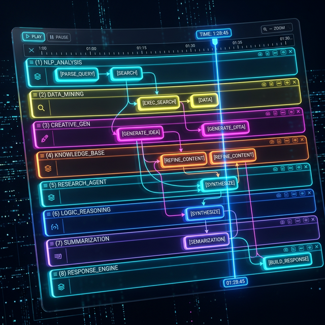

# ╔══════════════════════════════════════════════════════════════╗

# ║ ⏱️ PHASE 5: THE ORCHESTRATION LAYER — TIMELINE ║

# ║ Record everything. Scrub time. Branch reality. ║

# ╚══════════════════════════════════════════════════════════════╝

# ┌─────────────────────────────────────┐

# │ 📖 TABLE OF CONTENTS │

# └─────────────────────────────────────┘

- [5.1 Timeline Engine Interface](#51-timeline-engine-interface)
- [5.2 What Gets Recorded](#52-what-gets-recorded)
- [5.3 Visual Timeline (DAW View)](#53-visual-timeline)
- [5.4 Dependency Graph (Factorio View)](#54-dependency-graph)
- [5.5 Build Instructions](#55-build-instructions)
- [5.6 Validation Criteria](#56-validation-criteria)

---

## 5.1 Timeline Engine Interface

```typescript
interface TimelineEngine extends Module {
  type: "timeline";

  // Recording
  record(event: TimelineEvent): void;
  snapshot(): SystemState;

  // Navigation
  scrubTo(timestamp: number): SystemState;
  playback(from: number, to: number, speed: number): void;

  // Branching
  branch(name: string): BranchId;
  switchBranch(id: BranchId): void;
  mergeBranch(source: BranchId, target: BranchId): MergeResult;

  // Querying
  events(filter: EventFilter): TimelineEvent[];
  dependencies(taskId: string): DependencyGraph;

  ports: {
    events: Port<TimelineEvent>; // IN: everything reports here
    "timeline-state": Port<TimelineState>; // OUT: current state of timeline
    "playback-stream": Port<PlaybackFrame>; // OUT: for replay visualization
  };
}
```

---

## 5.2 What Gets Recorded

Everything. Append-only. Immutable.

| Event Type          | When                        | Data                                 |
| ------------------- | --------------------------- | ------------------------------------ |
| AGENT_TASK_START    | Agent begins work           | taskId, agentId, timestamp           |
| AGENT_TASK_COMPLETE | Agent finishes              | taskId, agentId, outputRef, duration |
| AGENT_TASK_ERROR    | Something broke             | taskId, agentId, error, stackTrace   |
| DATA_TRANSFER       | Data moved between entities | from, to, contentHash, size          |
| PIPE_CONNECT        | Connection established      | pipeId, sourceId, targetId           |
| PIPE_DISCONNECT     | Connection dropped          | pipeId, reason                       |
| USER_ACTION         | Human did something         | userId, action, target               |
| STATE_SNAPSHOT      | Periodic full capture       | fullSystemState (for scrubbing)      |
| BRANCH_CREATED      | Timeline forked             | branchId, parentBranch, forkPoint    |
| BRANCH_MERGED       | Branches joined             | sourceBranch, targetBranch, result   |

---

## 5.3 Visual Timeline (DAW View)



Like a Digital Audio Workstation or video editor:

- Each agent = horizontal track (swim lane)
- Tasks = colored blocks on tracks, sized by duration
- Dependencies = lines connecting blocks across tracks
- Playhead = current moment (everything left has happened)
- Branching = timeline literally forks into two paths
- Assembly points = glow where multiple outputs converge

The timeline can dock at canvas bottom or exist in z-space — pushed behind main workspace, pulled forward to inspect.

---

## 5.4 Dependency Graph (Factorio View)

A factory-floor view showing structural relationships:

- Which agents feed into which other agents
- Where bottlenecks are (backed-up queues, slow agents)
- Critical path (the chain that determines total duration)
- What runs in parallel vs. sequential

Toggle between DAW view (time-focused) and factory view (structure-focused).

---

## 5.5 Build Instructions

```
IN /packages/timeline:
  1. Implement TimelineEngine conforming to Module interface
  2. Append-only event log with indexing by type, agent, time range
  3. Periodic state snapshots (configurable interval, e.g., every 5 seconds)
  4. scrubTo() — find nearest snapshot, replay events from there to target
  5. branch() — fork the event log, independent event streams
  6. switchBranch() — change which branch events record to
  7. mergeBranch() — combine two branches (with conflict detection)
  8. playback() — emit events in sequence at configurable speed
  9. Visual: DAW-style multi-track renderer
  10. Visual: Factorio-style dependency graph renderer
  11. Toggle between both views
```

---

## 5.6 Validation Criteria

```
✅ TimelineEngine registers, health check passes
✅ Record 100 events. Query by type returns correct subset
✅ Scrub to event 50. State matches snapshot at that point
✅ Branch at event 50. Add events to branch. Switch back. Original intact
✅ Playback replays events in correct order at 2x speed
✅ DAW view renders tracks for 3 agents with task blocks
✅ Dependency lines connect related blocks across tracks
✅ Factorio view shows agent → agent data flow graph
✅ State snapshots serialize and deserialize correctly
```

---

# ┌─────────────────────────────────────┐

# │ 📖 TABLE OF CONTENTS (BOTTOM) │

# └─────────────────────────────────────┘

- [5.1 Timeline Engine Interface](#51-timeline-engine-interface)
- [5.2 What Gets Recorded](#52-what-gets-recorded)
- [5.3 Visual Timeline (DAW View)](#53-visual-timeline)
- [5.4 Dependency Graph (Factorio View)](#54-dependency-graph)
- [5.5 Build Instructions](#55-build-instructions)
- [5.6 Validation Criteria](#56-validation-criteria)
