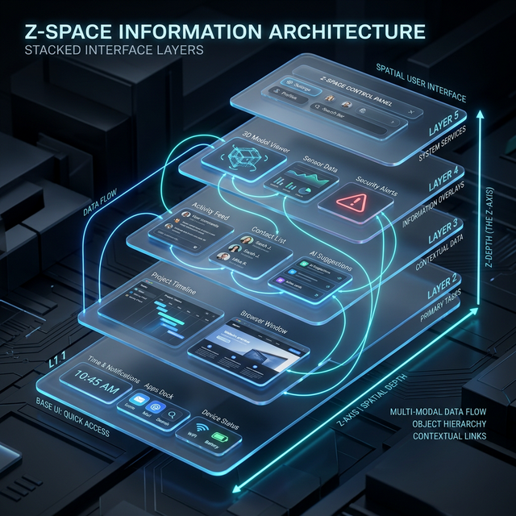

# ╔══════════════════════════════════════════════════════════════╗

# ║ 🌀 PHASE 6: Z-SPACE, SIMULATION & VIRTUAL PHYSICS ║

# ║ The third dimension as organization + malleable reality ║

# ╚══════════════════════════════════════════════════════════════╝

# ┌─────────────────────────────────────┐

# │ 📖 TABLE OF CONTENTS │

# └─────────────────────────────────────┘

- [6.1 Z-Space as Information Architecture](#61-z-space-as-information-architecture)
- [6.2 Entity-Component-System Architecture](#62-entity-component-system)
- [6.3 Game Simulation Patterns](#63-game-simulation-patterns)
- [6.4 The Malleable Physics Engine](#64-the-malleable-physics-engine)
- [6.5 Magic Systems — Engineered Impossibilities](#65-magic-systems)
- [6.6 Virtual Inventions Catalog](#66-virtual-inventions-catalog)
- [6.7 Module Interfaces](#67-module-interfaces)
- [6.8 Build Instructions](#68-build-instructions)
- [6.9 Validation Criteria](#69-validation-criteria)

---

## 6.1 Z-Space as Information Architecture



The third dimension is NOT decorative. It is an **organizational axis** that solves screen real estate.

### The Four Z-Operations

**STACK** — Things that are accessible but not actively needed move back in z-space. Like a deck of cards. You know they're there. Pull any one forward. But they don't clutter your view.

**SPREAD** — When you need to compare, review, or work across multiple things simultaneously, they fan out on the x/y plane. The canvas breathes outward.

**LAYER** — Different information types occupy different depth layers:

- Layer 0 (front): Active agent workspaces, primary interaction
- Layer 1 (mid): Pipe infrastructure, connection graph
- Layer 2 (back): Timeline and orchestration view
- Layer 3 (deep): Ledger, historical data, archived branches

**COLLAPSE** — On small screens, z-space compresses aggressively. Everything stacks. Navigation = pulling items forward. On large screens, z-space relaxes and more spreads out.

### Device-Adaptive Z-Strategy

| Device             | Z-Depth Range | Default Behavior                       | Navigation      |
| ------------------ | ------------- | -------------------------------------- | --------------- |
| Watch              | 2 layers      | Everything stacked, one item at front  | Swipe to cycle  |
| Phone (Fold inner) | 4 layers      | Light stacking, 2-3 items visible      | Pinch zoom in z |
| Tablet             | 6 layers      | Mixed stack/spread                     | Touch + pinch   |
| Laptop             | 8 layers      | Generous spread with background layers | Scroll + mouse  |
| TV / Multi-monitor | 12 layers     | Maximum spread, deep background layers | Remote/gamepad  |

### ZSpaceManager Interface

```typescript
interface ZSpaceManager extends Module {
  type: "zspace";

  // Assign depth to an entity
  assignLayer(entityId: string, layer: number): void;

  // Auto-organize: the system decides optimal z for each entity
  autoOrganize(strategy: "stack" | "spread" | "focus"): void;

  // Focus: bring one entity to front, push everything else back
  focus(entityId: string): void;

  // Fan: spread a set of entities across x/y at the same z-depth
  fan(entityIds: string[], layout: "grid" | "circle" | "arc"): void;

  // Collapse: stack everything for small-screen mode
  collapse(): void;

  // Adapt to device
  adaptToDevice(layoutHints: LayoutHints): void;

  ports: {
    "layout-requests": Port<LayoutRequest>;
    "z-assignments": Port<ZAssignment>;
  };
}
```

---

## 6.2 Entity-Component-System

Borrowed from game engines (Unity, Unreal, Godot). ECS is how we organize everything on the canvas without rigid class hierarchies.

### Core Concept

**Entity** = Just an ID. Any object on the canvas.
**Component** = A piece of data/behavior attached to an entity.
**System** = Logic that operates on all entities with a specific set of components.

### Standard Components

```typescript
// 🗺️ Where is it?
interface TransformComponent {
  position: Vector3; // x, y, z in canvas space
  rotation: Quaternion;
  scale: Vector3;
  parent?: EntityId; // Transform hierarchy
}

// 🎨 What does it look like?
interface RenderComponent {
  mesh: QualityAsset; // From the asset pipeline
  visible: boolean;
  layer: number; // Render order / z-layer
  opacity: number;
}

// 💗 Is it alive?
interface HeartbeatComponent {
  interval: number; // ms between ticks
  lastTick: number;
  onTick: () => void;
}

// 🧠 Does it think?
interface SoulComponent {
  name: string;
  personality: SoulConfig;
  llmBackend: string; // Which LLM module to use
}

// 🔧 What can it do?
interface SkillsComponent {
  skills: Skill[];
  tools: ToolAccess[];
  permissions: PermissionSet;
}

// 🔌 How does it connect?
interface PortsComponent {
  ports: Record<string, Port<unknown>>;
}

// 🎬 How does it move?
interface AnimationComponent {
  clips: AnimationClip[];
  activeClip: string;
  blendWeights: Record<string, number>;
}

// 🖱️ Can I interact with it?
interface InteractionComponent {
  hoverable: boolean;
  clickable: boolean;
  draggable: boolean;
  contextMenu: MenuItem[];
  onHover?: () => void;
  onClick?: () => void;
  onDrag?: (delta: Vector3) => void;
}

// ⚡ Does physics affect it?
interface PhysicsComponent {
  bodyType: "static" | "dynamic" | "kinematic";
  collider: ColliderShape;
  mass: number;
  // In our malleable physics, these can be overridden per-entity:
  customGravity?: Vector3;
  customFriction?: number;
  magnetism?: MagnetismConfig; // attract/repel other entities
}
```

### Standard Systems

```
RenderSystem       → Draws all entities with RenderComponent
HeartbeatSystem    → Ticks all entities with HeartbeatComponent
AnimationSystem    → Updates all entities with AnimationComponent
InteractionSystem  → Handles input for all entities with InteractionComponent
PhysicsSystem      → Simulates physics for all entities with PhysicsComponent
ZSpaceSystem       → Manages depth for all entities with TransformComponent
```

Adding new behavior = adding a new component + new system. Zero changes to existing code.

---

## 6.3 Game Simulation Patterns

| Game Pattern             | Canvas Application               | Implementation                                  |
| ------------------------ | -------------------------------- | ----------------------------------------------- |
| Rimworld colonists       | Agents with needs/skills/moods   | HeartbeatComponent + SoulComponent + mood state |
| Factorio conveyor belts  | Data pipes with flow             | PhysicsComponent on data packets + curve paths  |
| SimCity zones            | Project domains as spatial areas | ZSpaceManager zones with boundaries             |
| Civ tech tree            | Skill/capability dependencies    | Directed graph in SkillsComponent               |
| KSP physics              | Virtual mechanical simulation    | PhysicsComponent with custom gravity            |
| Dwarf Fortress tasks     | Agent task prioritization        | AgentRuntime task queue + priority              |
| Cities: Skylines traffic | Data throughput optimization     | Pipe capacity + routing algorithm               |

---

## 6.4 The Malleable Physics Engine

**In the virtual canvas, physics serves understanding, not realism.**

The physics engine is configurable per-entity and per-zone. This means:

### Gravity is a suggestion

- Agent workspaces can have zero gravity (floating panels)
- Data packets can have "pipe gravity" (they flow along pipes, not downward)
- The timeline zone can have "time gravity" (things drift toward the present)

### Magnetism is a feature

- Related information is magnetically attracted (clusters form automatically)
- Unrelated information repels (natural spacing)
- Focus mode: selected entity becomes a strong magnet, everything else pushes away

### Collision is semantic

- Agents can pass through each other (they're not physical objects)
- But agent WORKSPACES collide (they need distinct space)
- Data packets collide with pipe walls (they stay inside the pipe)
- UI panels collide with screen edges (they don't escape the viewport)

### Time is elastic

- Physics simulation speed can be independent of real time
- Slow-motion for complex assembly (watch data packets merge slowly)
- Fast-forward for long processes (skip boring parts)
- Pause for inspection (freeze everything, look around)

```typescript
interface SimulationEngine extends Module {
  type: "simulation";

  // Physics world with custom rules
  world: PhysicsWorld;

  // Override physics per entity
  setEntityPhysics(entityId: string, overrides: PhysicsOverrides): void;

  // Override physics per zone (spatial region)
  setZonePhysics(zone: BoundingBox, rules: ZonePhysicsRules): void;

  // Time control
  timeScale: number; // 0 = paused, 1 = real-time, 0.1 = slow-mo, 10 = fast
  pause(): void;
  resume(): void;
  stepForward(frames: number): void;

  ports: {
    "sim-commands": Port<SimCommand>;
    "sim-state": Port<SimState>;
    "visual-output": Port<VisualUpdate>;
  };
}
```

---

## 6.5 Magic Systems — Engineered Impossibilities

Because we control the simulation, we can build tools that would be physically impossible but are computationally real and visually comprehensible:

### The Magnifying Glass 🔍

- Point at any data structure, agent, or pipe
- It zooms into infinite detail — seeing inside an agent's thought process, inside a data packet's contents, inside a pipe's internal buffer
- Visually: a circular lens that distorts the scene around it and reveals a deeper layer

### The Time Telescope 🔭

- Look along a timeline branch and see predicted futures
- The further you look, the hazier the prediction (uncertainty visualization)
- Agents can use this to plan — "if I do X, the timeline predicts Y"

### Gravity Wells ⚫

- Place a gravity well on a topic/tag
- All related information across the entire canvas drifts toward it
- Remove the well and things drift back — non-destructive organization

### The Duplicator ✨

- Point at any entity and create a branch copy
- The copy exists in a parallel timeline branch
- Make changes to the copy. Compare with original. Merge the best parts.

### Teleportation Rings 🌀

- Place two rings anywhere on the canvas
- Data, references, or even agent attention can teleport between them
- Visually: particle trail enters one ring, exits the other with a flash

### The Assembler 🏗️

- A special zone where outputs from multiple agents converge
- Components float toward each other and magnetically snap together
- When assembly is complete: a satisfying fusion animation + the assembled output materializes
- This is the "badge/page comes to life procedurally" moment

### The Forge 🔥

- A zone where raw materials (data, drafts, components) are refined
- Input goes in rough. Output comes out polished.
- Visually: heat, hammering, sparks, transformation
- Mechanically: runs a quality refinement pipeline on whatever enters

---

## 6.6 Virtual Inventions Catalog

These are tools the builder agent should create as part of the canvas toolkit. Each is a module (or a set of ECS components) that can be placed on the canvas:

| Invention        | Visual Metaphor                  | Real Function                        |
| ---------------- | -------------------------------- | ------------------------------------ |
| Magnifying Glass | Lens that zooms infinitely       | Deep inspection of any entity        |
| Time Telescope   | Telescope aimed along timeline   | Predictive branch visualization      |
| Gravity Well     | Black hole effect                | Topic-based information clustering   |
| Duplicator       | Mirror/clone beam                | Timeline branching with entity copy  |
| Teleport Rings   | Portal pair                      | Spatial shortcuts for data/attention |
| Assembler        | Construction zone with magnets   | Multi-agent output convergence       |
| Forge            | Blacksmith workshop              | Quality refinement pipeline          |
| Compass          | Spinning needle pointing to goal | Priority/objective visualization     |
| Radar            | Scanning pulse                   | Find related entities across canvas  |
| Conveyor         | Moving belt                      | Automated data flow between zones    |
| Weather System   | Rain/sun/storms over zones       | Zone health/activity visualization   |
| Seed Planter     | Plant seed → watch it grow       | Procedural generation trigger        |

---

## 6.7 Module Interfaces

See [01-INTERFACES.md](./01-INTERFACES.md) for the base Module interface. The specific modules for this phase:

- **ZSpaceManager** — defined in section 6.1 above
- **SimulationEngine** — defined in section 6.4 above
- **ECS core** — EntityManager, ComponentStore, SystemRunner

---

## 6.8 Build Instructions

```
IN /packages/zspace:
  1. Implement ZSpaceManager conforming to Module interface
  2. Depth layer assignment system
  3. Auto-organize algorithms (stack, spread, focus, fan)
  4. Device-adaptive collapse/expand
  5. Camera depth navigation (dolly in/out through z-layers)

IN /packages/simulation:
  1. Implement SimulationEngine conforming to Module interface
  2. Physics world with per-entity and per-zone overrides
  3. Time control (pause, slow-mo, fast-forward, step)
  4. Custom gravity, magnetism, collision rules
  5. Implement 3 magic tools: Gravity Well, Assembler, Magnifying Glass
     (more can be added later — these 3 prove the pattern)

FOR ECS (in /packages/core or /packages/ecs):
  1. EntityManager — create/destroy entities, assign IDs
  2. ComponentStore — attach/detach/query components
  3. SystemRunner — register systems, run in order each frame
  4. All standard components defined in section 6.2
  5. All standard systems defined in section 6.2

EVOLUTIONARY TEST: Physics Engine
  Option A — Rapier (Rust/WASM, fastest benchmarks)
  Option B — Cannon.js (pure JS, most mature)
  Option C — Jolt (newer WASM engine, good perf)
  Test: 100 entities with physics, measure FPS
  Select winner. Archive others.
```

---

## 6.9 Validation Criteria

```
✅ ZSpaceManager assigns entities to layers correctly
✅ autoOrganize('stack') collapses all entities into depth stack
✅ autoOrganize('spread') fans entities across x/y
✅ focus() brings one entity forward, pushes others back with smooth animation
✅ Device adaptation: simulated mobile viewport triggers collapse
✅ ECS: Create entity, attach 3 components, query by component set → found
✅ ECS: RenderSystem draws all renderable entities
✅ ECS: HeartbeatSystem ticks all heartbeat entities
✅ SimulationEngine: 50 entities with physics at ≥55fps
✅ Gravity Well: place well, nearby entities drift toward it
✅ Assembler: 3 data objects enter zone, fuse into one assembled output
✅ Magnifying Glass: point at entity, detail view renders at higher LOD
✅ Time control: pause freezes all physics, resume continues
```

---

# ┌─────────────────────────────────────┐

# │ 📖 TABLE OF CONTENTS (BOTTOM) │

# └─────────────────────────────────────┘

- [6.1 Z-Space as Information Architecture](#61-z-space-as-information-architecture)
- [6.2 Entity-Component-System Architecture](#62-entity-component-system)
- [6.3 Game Simulation Patterns](#63-game-simulation-patterns)
- [6.4 The Malleable Physics Engine](#64-the-malleable-physics-engine)
- [6.5 Magic Systems — Engineered Impossibilities](#65-magic-systems)
- [6.6 Virtual Inventions Catalog](#66-virtual-inventions-catalog)
- [6.7 Module Interfaces](#67-module-interfaces)
- [6.8 Build Instructions](#68-build-instructions)
- [6.9 Validation Criteria](#69-validation-criteria)
