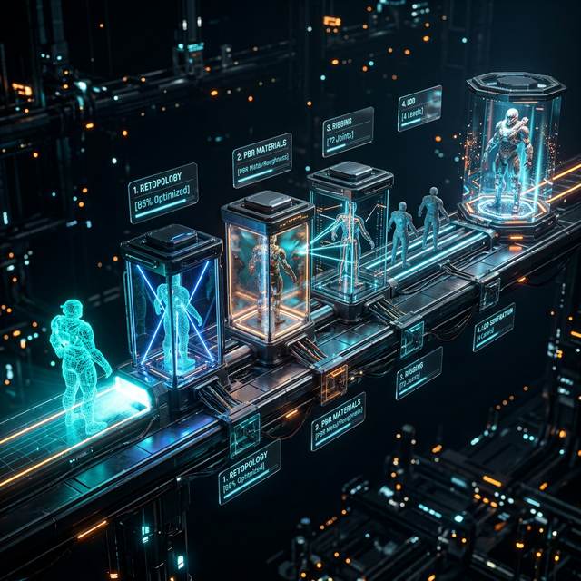

# ╔══════════════════════════════════════════════════════════════╗

# ║ 🎨 PHASE 7: THE 3D QUALITY PIPELINE ║

# ║ Beautiful, optimized, production-quality 3D assets ║

# ║ Characters, props, environments, animation, interaction ║

# ╚══════════════════════════════════════════════════════════════╝

# ┌─────────────────────────────────────┐

# │ 📖 TABLE OF CONTENTS │

# └─────────────────────────────────────┘

- [7.1 The Problem: Why Default 3D Is Unacceptable](#71-the-problem)
- [7.2 The Pipeline: From Nothing to Beautiful](#72-the-pipeline)
- [7.3 Asset Generation Methods (Evolutionary)](#73-asset-generation-methods)
- [7.4 The Quality Checklist — 20 Points](#74-the-quality-checklist)
- [7.5 Procedural Generation Patterns](#75-procedural-generation-patterns)
- [7.6 Character System](#76-character-system)
- [7.7 Animation & Interaction](#77-animation--interaction)
- [7.8 AI 3D Tools Integration](#78-ai-3d-tools-integration)
- [7.9 Optimization Budget](#79-optimization-budget)
- [7.10 The AssetPipeline Module Interface](#710-the-assetpipeline-module-interface)
- [7.11 Build Instructions](#711-build-instructions)
- [7.12 Validation Criteria](#712-validation-criteria)

---

## 7.1 The Problem

AI coding agents produce 3D that looks like this:

- Flat gray boxes with no materials
- Default lighting that washes everything out
- No shadows, no ambient occlusion, no atmosphere
- Static — nothing moves, breathes, or responds
- No optimization — scenes chug at 20fps

The Living Canvas must look like a **high-quality indie game**, not a WebGL demo from 2012. Every element on the canvas — agent avatars, workspaces, pipes, data packets, timeline blocks, z-space panels — must be visually polished, animated, and performant.

---

## 7.2 The Pipeline: From Nothing to Beautiful



Every 3D asset in the system flows through this pipeline:

```
┌─────────────┐     ┌──────────────┐     ┌─────────────┐     ┌───────────────┐
│  GENERATE   │ ──→ │   REFINE     │ ──→ │  OPTIMIZE   │ ──→ │  INTEGRATE    │
│             │     │              │     │             │     │               │
│ • Procedural│     │ • Materials  │     │ • LOD       │     │ • Scene graph │
│ • AI tools  │     │ • Lighting   │     │ • Instancing│     │ • Animation   │
│ • Library   │     │ • UVs/Tex   │     │ • Budgets   │     │ • Interaction │
│ • Manual    │     │ • Rigging    │     │ • Atlas     │     │ • Physics     │
└─────────────┘     └──────────────┘     └─────────────┘     └───────────────┘
```

### Stage 1: GENERATE — Create the raw geometry

Multiple methods, selected per asset type:

| Asset Type       | Best Generation Method                              | Fallback                        |
| ---------------- | --------------------------------------------------- | ------------------------------- |
| Agent avatars    | AI tool (Meshy/Tripo) from character description    | Procedural parametric humanoid  |
| Workspace panels | Procedural (rounded rect + depth + bevel)           | Parametric box with subdivision |
| Data pipes       | Procedural (curve + tube geometry + flow particles) | Cylinder chain                  |
| UI elements      | Procedural (SDF shapes + extrusion)                 | Sprite-based 2.5D               |
| Environment      | Procedural (noise terrain + scatter)                | Skybox + ground plane           |
| Props/icons      | AI tool from text description                       | SVG extrusion                   |
| Particle effects | Procedural (GPU particles)                          | Billboard sprites               |

### Stage 2: REFINE — Make it look production-quality

Every asset gets:

- **PBR materials** — physically-based rendering with proper roughness, metalness, normal maps
- **Environment mapping** — reflections from the scene's environment (HDRI or generated)
- **Proper UV mapping** — textures don't stretch or tile visibly
- **Rigging** (if animated) — skeleton, weight painting, IK constraints
- **Post-processing touchup** — check it looks right with the scene's post-processing stack

### Stage 3: OPTIMIZE — Make it run at 60fps

- **LOD generation** — 3+ detail levels per asset, auto-switching by camera distance
- **Instancing** — identical objects share geometry/materials (agent icons, pipe segments, particles)
- **Texture atlasing** — combine small textures into atlases to reduce draw calls
- **Geometry budget** — enforce triangle count limits per asset category
- **Occlusion culling** — don't render what's behind other things

### Stage 4: INTEGRATE — Make it alive in the scene

- **Scene graph placement** — proper transform hierarchy, parent-child relationships
- **Animation binding** — connect to heartbeat system, state changes, user input
- **Interaction setup** — raycast targets, hover states, click handlers, drag behavior
- **Physics registration** — collision shapes, rigid/soft body assignment if needed
- **Sound integration** — spatial audio triggers for interactions and state changes

---

## 7.3 Asset Generation Methods (Evolutionary)

Build THREE generation pipelines. Test. Select best per asset category:

### Option A — AI-Assisted (Meshy/Tripo + Refinement)

```
Text description → AI 3D tool API → Raw mesh
→ Auto-retopologize (reduce poly count, clean topology)
→ Auto-UV (smart UV projection)
→ Apply PBR material templates
→ Auto-rig (if character)
→ Quality check against checklist
```

**Pros:** High variety, organic shapes, fast for characters/props
**Cons:** Inconsistent quality, may need manual cleanup, API dependency
**Best for:** Agent avatars, unique props, organic shapes

### Option B — Procedural Generation (Geometry Nodes Patterns in Code)

```
Parameters → Procedural algorithm → Clean geometry
→ Built-in proper topology
→ Parametric UV mapping
→ Parametric PBR materials (noise-driven)
→ Procedural animation curves
→ Quality check against checklist
```

Implement Geometry Nodes-style patterns in JavaScript/TypeScript:

```typescript
// Example: Procedural workspace panel (Geometry Nodes pattern)
function generateWorkspacePanel(params: PanelParams): Mesh {
  // Start with rounded rectangle profile
  const profile = roundedRect(params.width, params.height, params.cornerRadius);
  // Extrude with bevel
  const geometry = extrude(profile, params.depth, { bevel: params.bevelSize });
  // Add subdivision for smoothness
  const smooth = subdivide(geometry, params.subdivisions);
  // Apply noise displacement for subtle organic feel
  const displaced = displaceByNoise(
    smooth,
    params.noiseScale,
    params.noiseAmount,
  );
  // Generate UVs
  const uvMapped = projectUVs(displaced, "box");
  // Apply PBR material
  const material = createPBR({
    baseColor: params.color,
    roughness: 0.4,
    metalness: 0.1,
    normalMap: generateNoiseNormal(params.noiseScale * 2),
    emissive: params.accentColor,
    emissiveIntensity: params.glowAmount,
  });
  return new Mesh(uvMapped, material);
}
```

**Pros:** Perfectly consistent, parametric (one function makes infinite variants), no API dependency, built-in optimization
**Cons:** Limited to geometric/architectural shapes, organic forms are hard
**Best for:** Panels, pipes, UI elements, environments, particles

### Option C — Hybrid (AI Generation + Procedural Refinement)

```
AI generates base mesh → Procedural pipeline refines it
→ Auto-retopo using procedural rules
→ Procedural material assignment
→ Procedural LOD generation
→ Procedural rigging (bone placement by mesh analysis)
→ Quality check against checklist
```

**Pros:** Best of both worlds — variety from AI, consistency from procedural
**Cons:** Most complex pipeline, two dependencies
**Best for:** Characters that need to look unique but perform well

---

## 7.4 The Quality Checklist — 20 Points

Every 3D asset is scored against this checklist before it enters the scene. Score 1-5 on each. Minimum total: 70/100. Below 70 = send back through the pipeline.

```
MATERIALS (25 points)
  [ ] PBR material applied (not Lambert/Phong/default)         /5
  [ ] Roughness map or value is scene-appropriate               /5
  [ ] Metalness is physically plausible                         /5
  [ ] Normal map adds surface detail without geometry cost       /5
  [ ] Emissive used intentionally (UI glow, status indicators)  /5

GEOMETRY (25 points)
  [ ] Triangle count within budget for asset category            /5
  [ ] No degenerate triangles, flipped normals, or z-fighting   /5
  [ ] Smooth where smooth, sharp where sharp (proper normals)    /5
  [ ] LOD levels generated (3+ levels)                          /5
  [ ] Proper topology (no n-gons, reasonable edge flow)          /5

LIGHTING & SCENE (25 points)
  [ ] Receives and casts shadows appropriately                   /5
  [ ] Environment reflections work (for reflective materials)    /5
  [ ] Looks correct under scene's post-processing                /5
  [ ] Consistent visual language with other canvas elements      /5
  [ ] Readable at all z-depth levels (not too dark/bright)       /5

ANIMATION & INTERACTION (25 points)
  [ ] Idle animation exists (breathing, pulsing, subtle motion)  /5
  [ ] State transitions are animated (not instant swaps)         /5
  [ ] Hover/select visual feedback is clear and immediate        /5
  [ ] Animation performance stays within frame budget             /5
  [ ] Interaction raycast targets are accurate to visual shape    /5
```

---

## 7.5 Procedural Generation Patterns

These are Geometry Nodes-inspired patterns implemented in code. The builder agent should create a library of these reusable generators:

### Pattern: Profile + Extrude + Bevel

For panels, frames, buttons, workspace borders.
Take a 2D profile curve, extrude to depth, bevel edges for quality.

### Pattern: Curve + Tube + Flow

For pipes, connections, data paths.
Define a curve between two points, generate tube geometry along it, add animated particles flowing through.

### Pattern: Scatter + Instance

For environments, backgrounds, particle fields.
Scatter points on a surface or in a volume, instance geometry at each point with random variation.

### Pattern: SDF + March

For smooth organic shapes, blobs, merged forms.
Define shapes as signed distance functions, mesh via marching cubes, smooth result.

### Pattern: Noise + Displace

For terrain, organic surfaces, living textures.
Start with regular geometry, displace vertices by noise (Perlin, Simplex, Worley).

### Pattern: Parametric Surface

For mathematical shapes, UI curves, data visualization geometry.
Define surface as function of (u, v), sample grid, generate mesh.

### Pattern: Skeleton + Skin

For characters, creatures, articulated objects.
Define bone hierarchy, generate mesh around bones, weight vertices to bones.

---

## 7.6 Character System

Agents on the canvas are represented by characters. Characters need:

### Visual Identity

- Distinct silhouette (recognizable even at small size / deep z-depth)
- Color-coded by role/status (matches the agent's soul personality)
- Readable name label that scales with distance
- Status indicators (working, idle, error) as visual effects (glow, particles, animation speed)

### Rigging & Animation

- Skeleton with at minimum: root, spine, head, 2 arms
- Idle animation: subtle breathing/floating motion (2-4 second cycle)
- Working animation: active motion, particles, energy effects
- Transition animations: idle→working, working→complete, error shake
- Emote animations: acknowledge, celebrate, confused, thinking

### Quality Levels

- **LOD 0 (close up):** Full detail, all animations, facial expression if applicable
- **LOD 1 (medium):** Simplified mesh, key animations only
- **LOD 2 (far/z-depth):** Billboard sprite or simple icon, pulse animation only
- **LOD 3 (minimap):** Colored dot with status indicator

### Generation Strategy

```
1. Agent soul defines personality → map to visual traits
   (e.g., analytical soul → geometric avatar, creative soul → organic avatar)
2. Generate base mesh via AI tool or procedural skeleton+skin
3. Refine through quality pipeline
4. Generate LOD levels
5. Bind animations
6. Register in scene with interaction handlers
```

---

## 7.7 Animation & Interaction

### The Heartbeat-Animation Link

Every agent has a heartbeat tick. The visual layer listens to heartbeats and responds:

```typescript
agent.onHeartbeat(() => {
  // Subtle pulse on the avatar
  avatar.scale.lerp(PULSE_SCALE, 0.1);
  // Glow intensity follows health
  avatar.material.emissiveIntensity = agent.health().healthy ? 0.3 : 0.8;
  // Particle rate follows workload
  avatar.particles.rate = agent.status === "working" ? 50 : 5;
});
```

### State-Driven Animation

```
idle     → gentle floating, slow breathing, low particle rate
working  → active motion, faster particles, focused glow
waiting  → pulsing, looking toward dependency, dimmed
error    → red glow, shake, warning particles
complete → celebration burst, green flash, settle to idle
```

### Interaction Model

- **Hover:** Highlight outline, show tooltip with agent name/status
- **Click:** Select agent, expand workspace zone, show details
- **Drag:** Reposition agent on canvas (x/y), or push/pull in z-space
- **Long press / right click:** Context menu (assign task, view history, check permissions, swap LLM backend)

### Physics-Based Secondary Motion

- Agent zones have slight inertia when moved (overshoot + settle)
- Pipes flex and bounce when data flows through them
- Stacked panels have subtle spring physics when shuffled
- Z-space transitions have depth-of-field blur during movement

---

## 7.8 AI 3D Tools Integration

### Meshy Integration

```
Meshy API → Text-to-3D or Image-to-3D
→ Returns: GLB/GLTF mesh with textures
→ Pipeline: Download → Validate → Retopo → UV → Material → Rig → Optimize → Integrate

Endpoint: https://api.meshy.ai/v2/text-to-3d
Input: { prompt, art_style, topology }
Output: GLB file URL

NOTE: Meshy may require API key. If unavailable, fall back to procedural generation.
      The interface remains the same — the AssetPipeline module handles the swap.
```

### Tripo Integration

```
Tripo API → Text-to-3D with animation support
→ Returns: Rigged, animated GLB
→ Pipeline: Download → Validate → Quality check → Optimize → Integrate

NOTE: Same fallback strategy as Meshy. API key dependent.
```

### Fallback: Pure Procedural

If AI tools are unavailable (no API key, rate limited, offline):

- Characters: Skeleton+Skin procedural generation with parametric features
- Props: SDF+March or Profile+Extrude
- Environments: Noise+Displace terrain + Scatter+Instance objects
- All get full quality pipeline treatment

**The AssetPipeline interface is the same regardless of source.** Request an asset → get a quality asset. Where it came from is an implementation detail.

---

## 7.9 Optimization Budget

Target: **60fps on a mid-range 2023 smartphone** (Galaxy A54 class)

| Category                           | Triangle Budget | Draw Call Budget | Texture Memory |
| ---------------------------------- | --------------- | ---------------- | -------------- |
| Agent avatars (total, all visible) | 50,000          | 10               | 32MB           |
| Workspace panels (total)           | 20,000          | 8                | 16MB           |
| Pipes and connections (total)      | 15,000          | 5                | 8MB            |
| Particles (total active)           | 10,000          | 3                | 4MB            |
| Environment/background             | 10,000          | 3                | 16MB           |
| UI overlay elements                | 5,000           | 4                | 8MB            |
| **TOTAL BUDGET**                   | **110,000**     | **33**           | **84MB**       |

### Optimization Techniques (implement all)

- **Frustum culling** — only render what's in the camera view
- **Occlusion culling** — don't render what's behind other things
- **LOD switching** — swap to simpler meshes at distance
- **Instance rendering** — shared geometry for identical objects
- **Texture atlasing** — combine textures to reduce material swaps
- **GPU instancing** — render many copies of same mesh in one draw call
- **Object pooling** — reuse objects instead of create/destroy
- **Lazy loading** — only load assets when they enter view frustum

---

## 7.10 The AssetPipeline Module Interface

```typescript
interface AssetPipeline extends Module {
  type: "asset";

  // Request an asset — the pipeline handles generation + refinement + optimization
  request(spec: AssetSpec): Promise<QualityAsset>;

  // Check quality of an existing asset
  audit(asset: QualityAsset): QualityScore;

  // Registered generation methods (for evolutionary testing)
  generators: AssetGenerator[];
  activeGenerator: AssetGenerator;

  ports: {
    "asset-requests": Port<AssetSpec>; // IN: what do you need?
    "quality-assets": Port<QualityAsset>; // OUT: here it is, quality-checked
  };
}

interface AssetSpec {
  type:
    | "character"
    | "panel"
    | "pipe"
    | "prop"
    | "environment"
    | "particle"
    | "ui";
  description: string; // What should this look like?
  style: "geometric" | "organic" | "stylized" | "realistic";
  animated: boolean;
  interactive: boolean;
  lodLevels: number; // How many detail levels (minimum 2)
  maxTriangles: number; // Budget for this asset
  targetDevice: "mobile" | "desktop" | "tv"; // Optimization target
}

interface QualityAsset {
  mesh: BufferGeometry; // Or GLTF scene
  material: Material | Material[];
  lods: BufferGeometry[]; // Lower-detail versions
  skeleton?: Skeleton; // If rigged
  animations?: AnimationClip[]; // If animated
  interactionTargets?: Mesh[]; // For raycasting
  qualityScore: QualityScore; // Audit results
}

interface QualityScore {
  total: number; // Out of 100
  materials: number; // Out of 25
  geometry: number; // Out of 25
  lighting: number; // Out of 25
  animation: number; // Out of 25
  passed: boolean; // total >= 70
}
```

---

## 7.11 Build Instructions

```
IN /packages/asset-pipeline:

1. CREATE asset-pipeline.ts
   - Implement AssetPipeline conforming to Module interface
   - Asset request queue with priority

2. CREATE generators/
   - generators/procedural.ts — All procedural generation patterns
     (profile+extrude, curve+tube, scatter+instance, SDF, noise+displace, parametric, skeleton+skin)
   - generators/ai-meshy.ts — Meshy API integration with fallback
   - generators/ai-tripo.ts — Tripo API integration with fallback
   - generators/hybrid.ts — AI generation + procedural refinement

3. CREATE refiner.ts
   - PBR material application templates
   - Auto-UV projection
   - Normal map generation
   - Rigging pipeline (bone placement, weight painting)

4. CREATE optimizer.ts
   - LOD generation (mesh decimation)
   - Instance detection and setup
   - Texture atlas builder
   - Triangle budget enforcement
   - Performance profiling (measure actual frame impact)

5. CREATE quality-audit.ts
   - Implement the 20-point checklist as automated tests
   - Score calculation
   - Pass/fail determination
   - Feedback for re-generation (what failed and why)

6. CREATE character-system.ts
   - Soul-to-visual mapping (personality → visual traits)
   - Character generation pipeline
   - Animation binding (heartbeat link, state-driven)
   - LOD level management
   - Interaction handler setup

7. RUN evolutionary test:
   - Generate 5 test assets using each generator (procedural, AI, hybrid)
   - Score each through quality audit
   - Measure frame rate impact of each
   - SELECT best generator per asset category
   - DOCUMENT results in /docs/decisions/asset-generators.md
```

---

## 7.12 Validation Criteria

```
ALL of the following must pass:

✅ AssetPipeline registers as a module with working health check
✅ Procedural generator creates a workspace panel that scores ≥70/100
✅ Procedural generator creates a pipe/tube that scores ≥70/100
✅ Character generation produces a rigged, animated avatar that scores ≥70/100
✅ LOD system generates 3 levels and switches correctly by distance
✅ Frame rate stays ≥55fps with 5 agents + 10 pipes on mid-range device sim
✅ Quality audit correctly fails an asset with default gray Lambert material
✅ Quality audit correctly passes a well-made PBR asset
✅ If AI tools unavailable, fallback to procedural works without errors
✅ Character idle animation runs smoothly, linked to heartbeat
✅ Character state transitions animate (idle→working→complete→idle)
✅ Interaction (hover, click, drag) works on generated characters
```

---

# ┌─────────────────────────────────────┐

# │ 📖 TABLE OF CONTENTS (BOTTOM) │

# └─────────────────────────────────────┘

- [7.1 The Problem: Why Default 3D Is Unacceptable](#71-the-problem)
- [7.2 The Pipeline: From Nothing to Beautiful](#72-the-pipeline)
- [7.3 Asset Generation Methods (Evolutionary)](#73-asset-generation-methods)
- [7.4 The Quality Checklist — 20 Points](#74-the-quality-checklist)
- [7.5 Procedural Generation Patterns](#75-procedural-generation-patterns)
- [7.6 Character System](#76-character-system)
- [7.7 Animation & Interaction](#77-animation--interaction)
- [7.8 AI 3D Tools Integration](#78-ai-3d-tools-integration)
- [7.9 Optimization Budget](#79-optimization-budget)
- [7.10 The AssetPipeline Module Interface](#710-the-assetpipeline-module-interface)
- [7.11 Build Instructions](#711-build-instructions)
- [7.12 Validation Criteria](#712-validation-criteria)
